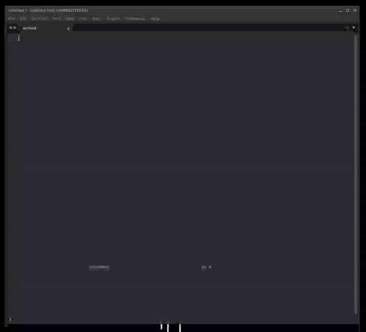

# IPman
Tired of copying and pasting the IP address while playing a CTF?

## Demo


## Install

### Requirements
* Python3
> Install python3 with your distribution's package manager.

* PyGTK
> Follow the instructions [here](https://pygobject.readthedocs.io/en/latest/getting_started.html)

* PyNput
```bash
python3 -m pip install pynput
```

### ipman.py
* Use this command to get the python script.
```bash
wget https://raw.githubusercontent.com/compromyse/ipman/main/ipman.py

OR

curl -LO https://raw.githubusercontent.com/compromyse/ipman/main/ipman.py
```

* Move this script to any writable directory.
```bash
mv ipman.py /any/directory/ipman.py
```

### Set the keyboard shortcut
This depends on your desktop environment. 
Navigate to your keyboard shortcuts setting. 

Add a shortcut with the command as `python3 /opt/ipman.py paste` and the shortcut as whatever you want the "paste" shortcut to be. This will be the shortcut that will paste the IP. 

Add another shortcut with the command as `python3 /opt/ipman.py setip` and the shortcut as whatever you want the "SetIP" shortcut to be. This shortcut will open the window to set the IP address.
